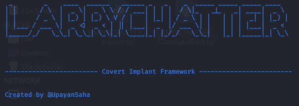
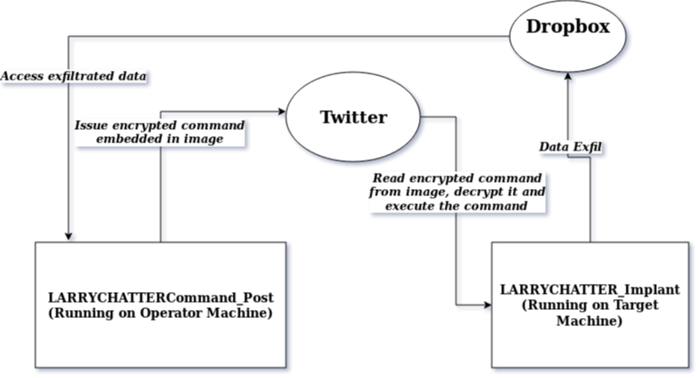
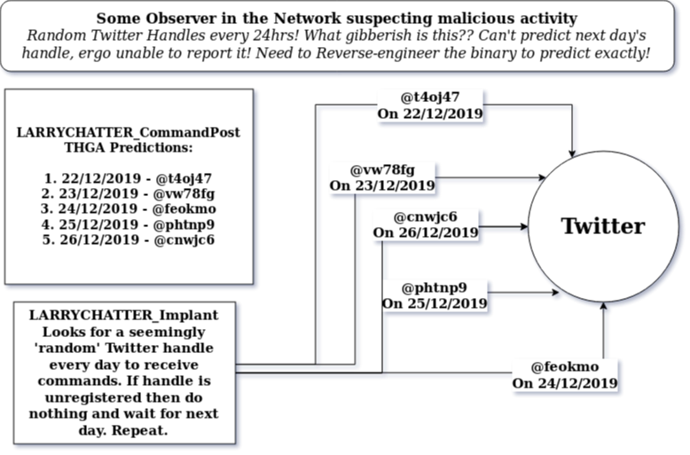

[](https://www.python.org/) 
[](https://github.com/Naereen/StrapDown.js/blob/master/LICENSE)



# LARRYCHATTER


## Introduction:
Introducing a  super-stealthy  extra sneaky Python-based Implant that uses Twitter & Dropbox as a C2 Server.
This project has been inspired by the Russian threat-group APT-29's own malware HAMMERTOSS tDiscoverer variant.
In fact, LARRYCHATTER is HAMMERTOSS Revenant. A Reincarnation. In pure Python. It's a lot similiar except that it's better.


## A Simplified Block Diagram First:



## Another One Of Twitter Handle Generation Algorithm:



## Etymology:
So y'all might be wondering what sort of a peculiar name is LARRYCHATTER? So you have seen the cute bird in the Twitter logo right? Well her name is Larry and since this Implant communicates over Twitter(chatter), I figured it's only appropiate I name it LARRYCHATTER.


## Prerequisites:
For this to work you will need:
- A Twitter Dev Account (**Please use a dedicated account! Do NOT use your personal one!**)
Create an App with Read, Write access. Specifically note down the CONSUMER KEY, CONSUMER SECRET, ACCESS TOKEN and ACCESS TOKEN SECRET values (I am not gon' tell you guys how, go Google it, should be a pretty easy thing to do)
Also note down the Handle/Username of your Twitter Account.
- A Dropbox Account. (**Please use a dedicated account! Do NOT use your personal one!**) 
Generate an API Token. (Again not gon' explain how, pretty easy to figure it out)


## File Organization:
This repository contains two files:
- ```LARRYCHATTER_CommandPost.py``` which is the source-code of the LARRYCHATTER Command Post(CP).
- ```LARRYCHATTERImplant.py``` which is the source-code of the LARRYCHATTER Implant.


## To Do:
- [ ] Integrate Twitter Handle Generation Algorithm
