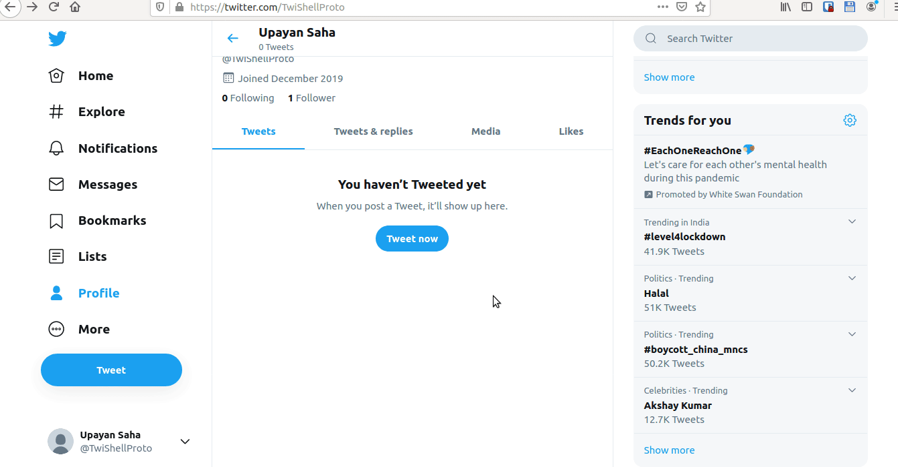

[](https://www.python.org/)
[](https://github.com/Naereen/StrapDown.js/blob/master/LICENSE)

#

# LARRYCHATTER

## Introduction:
Introducing a Proof-of-Concept code for the Russian threat-group APT-29's HAMMERTOSS tDiscoverer malware.
While reading the excellent report by FireEye, I was impressed with the idea so much that I decided to replicate it and that was the birth of LARRYCHATTER. This concept, although nothing new, is not seen a lot especially with nation-state APTs like APT-29. The other I can think of is the Indian Patchwork team though I am sure there might be others too with the same trick up their sleeves.
In fact, LARRYCHATTER is HAMMERTOSS Revenant. A Reincarnation in pure Python3. It's a lot similar except that it is better(maybe).

## A Simplified Block Diagram First:


## Another One Of Twitter Handle Generation Algorithm:


## So What Is LARRYCHATTER Exactly?
LARRYCHATTER is meant to be a PoC demonstrating the magical abilities of C2 over covert channels in social media. It is primarily aimed at professional red-teamers for red-team engagements and to make the life of Blue-teamers a lot-less easy! Modules can be written in Python and integrated at the click of a finger. The Prototype version of LARRYCHATTER comes with two modules - a 'recon' module and a 'kill' module in-built which is albeit very crude and doesn't do much apart from a very basic system information collection. My main goal is to demonstrate how easily malware traffic can fly under the radar by utilizing legitimate traffic and mimicking normal human behaviour. Additional modules and advancement of existing ones as well as a full-fledged C2 framework which uses DNS-over-HTTPS(DoH) for data exfiltration is coming soon, so stay tuned ;)

## A demo of the CommandPost:


I guess I was too lazy to blur out the API keys but don't bother using them because they have been revoked. So please create your own :)

## Terminology:
LARRYCHATTER PoC consists of:
- CommandPost - The LP which is used to issue commands to the Implant - run by the Operator.
- Implant - The agent - run on the target machine.

This repository contains four Python3 source files:
- `LARRYCHATTER_CommandPost.py` which is the source code of the LARRYCHATTER Command Post(CP).
- `LARRYCHATTERImplant.py` which is the source code of the LARRYCHATTER Implant.
- `decrypter.py` to decrypt the Intel collected by the Implant from the target machine and uploaded to Dropbox.
- `generateHandle.py` which contains the code for the Twitter Handle Generation Algorithm.

## Features:
- Stupid simple code - Easy to comprehend
- Nothing needs to be hardcoded on the Implant side including API keys which makes it resilient to account takedowns etc.
- No suspicious HTTP/HTTPS traffic to external, unknown domains for C&C - Only traffic observed is Twitter and Dropbox! Might aid in Firewall/IDS evasion since it is basically designed to mimic human behaviour so as to make the malware traffic appear legitimate in the hopes of bypassing network security solutions.
- 'kill' module - Terminates the Implant on the target machine.
- 'recon' module - Performs initial recon on the target system like basic system information, patches installed, take screenshots on a random interval for 'x' minutes and searches for all types of juicy file-types for exfiltration later and encrypts all the collected Intel and zips it into a single file before uploading it to Dropbox for retrieval by the Operators later. Currently Windows support only. Very crude. No AV-Evasion subroutines but fully functional.
- Basic Steganography integrated.
- Hardcoded symmetric encryption support built-in using 128-bit AES in CBC Mode.
- Coded in Python 3.
- Single Implant support only by CommandPost since this is only the Prototype version.
- To test the Twitter Handle Generation Algorithm, you'd need multiple Twitter Developer API keys but linking the THGA with the code should be a breeze. For simplicity's sake, it doesn't come integrated so that everyone can test it easily.

## Etymology:
So y'all might be wondering what sort of a peculiar name is LARRYCHATTER? So have you seen the cute bird in the Twitter logo? Well it turns out her name is Larry and since this Implant communicates(chatter) over Twitter, I figured it's only appropriate I name it LARRYCHATTER.

## Prerequisites:
For this to work you will need:
- A Twitter Dev Account (**Please use a dedicated account! Do NOT use your personal one!**)
Create an App with Read, Write access. Specifically note down the CONSUMER KEY, CONSUMER SECRET, ACCESS TOKEN and ACCESS TOKEN SECRET values. This should be fairly easy to do.
Also, note down the Handle/Username of your Twitter Account.
- A Dropbox Account. (**Again, please use a dedicated account! Do NOT use your personal one!**) 
Generate an API Token. Again, a pretty easy task.
- A Linux VM and a Windows 7/8/10 VM with Python3 installed on both the machines.

## Guide to test the PoC in 9 easy steps:
Install the required Python dependencies on both machines.

```
pip install -r requirements.txt
```

Run `LARRYCHATTER_CommandPost.py` on the Linux VM(operator machine) and follow the instructions therein. Type `help` for further assistance.

```
python3 LARRYCHATTER_CommandPost.py
```

Open `LARRYCHATTER_Implant.py` file from the Windows VM, modify the variable ***handle*** to your created Twitter username and type this to spit out a Windows executable from the Python script:

```
pip install pyinstaller
pyinstaller -F -w LARRYCHATTER_Implant.py
```

Execute the binary generated in the previous step on the Windows VM.

Run the `recon` command on the Command Post and follow the on-screen instructions. A sample image named `caravaggio.jpg` is included in the repository. The file-size must be less than **5MB** for the PoC to work.

Wait for some time for the Implant to do its job and collect the intel.

Check Dropbox for the intel ZIP file, download and extract it on operator machine.

Run `kill` command on the Command Post to kill the Implant on the target machine when you are done.

Decrypt the intel with the help of the `decrypter.py` and Profit!!

### Note - Don't forget to change the Encryption keys!

## To Do:
- [ ] Modify the 'recon' module to add more features
- [ ] Integrate different post-exploitation modules
- [ ] Create Anti-Detection modules to detect Sandboxes/Debuggers etc
- [ ] Add an Implant generator script to automate the process of building an executable from the python script
- [ ] Add traditional C2 channel support as a backup measure
- [ ] Create a full-fledged C2 framework
